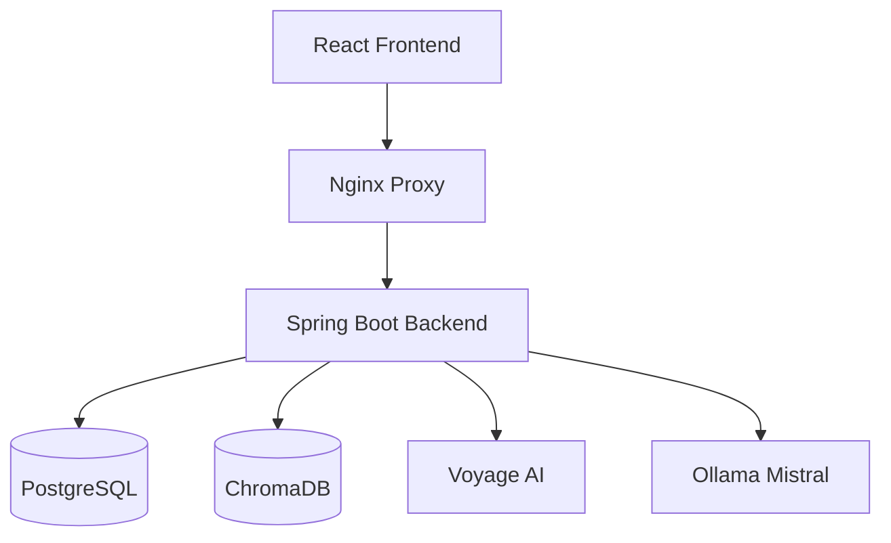

# Enterprise Document Analyzer

Enterprise Document Analyzer is a retrieval-augmented generation (RAG) application for uploading enterprise documents, indexing their content, and asking grounded questions with citations.

The application uses a React frontend, a Spring Boot backend, PostgreSQL for metadata, ChromaDB for vector search, Voyage AI for embeddings, and Ollama Mistral for answer generation. Chat responses are streamed from the backend to the UI with server-sent events (SSE).

## Features

- Upload and process documents for semantic search.
- Extract and chunk document text for indexing.
- Generate embeddings with Voyage AI.
- Store vectors in ChromaDB.
- Ask natural language questions against uploaded documents.
- Stream LLM responses incrementally to the frontend.
- Return citations alongside generated answers.
- View basic analytics and application settings from the UI.

## Architecture



## Core Flow

### Document ingestion

1. A document is uploaded through the frontend.
2. The backend extracts text and splits it into chunks.
3. Voyage AI generates embeddings for each chunk.
4. Chunks and metadata are stored in PostgreSQL.
5. Embeddings are stored in ChromaDB.

### Question answering

1. A user submits a question.
2. The backend embeds the query with Voyage AI.
3. ChromaDB returns the top matching chunks.
4. The backend builds a grounded prompt with retrieved context.
5. Ollama generates a streamed response.
6. The backend forwards streamed chunks to the frontend over SSE.
7. The UI appends chunks incrementally and shows citations when complete.

## Technology Stack

### Backend

- Java 21
- Spring Boot 3.2
- Spring Web
- Spring WebFlux
- Spring Data JPA
- PostgreSQL
- Apache PDFBox

### Frontend

- React 18
- react-scripts 5

### Infrastructure

- Docker and Docker Compose
- Nginx
- ChromaDB
- Ollama

### AI services

- Voyage AI for embeddings
- Ollama with Mistral for grounded answer generation

## Repository Layout

```text
.
|-- src/main/java                  Spring Boot source
|-- src/main/resources            Backend configuration
|-- src/test/java                 Backend tests
|-- frontend/src                  React application source
|-- docker-compose.yml            Full application stack
|-- Dockerfile                    Backend image build
|-- frontend/Dockerfile           Frontend image build
|-- nginx.conf                    Reverse proxy configuration
|-- start.bat                     Windows Docker startup helper
|-- start.sh                      Linux/macOS Docker startup helper
|-- uploads/                      Uploaded files
|-- backups/                      Database backups
```

## Prerequisites

For the Docker workflow:

- Docker Desktop or Docker Engine with Compose

For local development:

- Java 21
- Maven 3.9+
- Node.js 20+
- npm
- PostgreSQL
- Ollama
- A Voyage AI API key
- ChromaDB

## Quick Start With Docker

Docker is the primary way to run the full stack.

### 1. Create an environment file

Copy `.env.example` to `.env` and replace placeholder values with real ones.

Recommended variables:

```env
SPRING_DATASOURCE_URL=jdbc:postgresql://postgres:5432/docdb
SPRING_DATASOURCE_USERNAME=docuser
SPRING_DATASOURCE_PASSWORD=docpass123

OLLAMA_BASE_URL=http://ollama:11434
OLLAMA_MODEL=mistral

VOYAGE_API_KEY=your-voyage-api-key
VOYAGE_BASE_URL=https://api.voyageai.com/v1/embeddings
VOYAGE_MODEL=voyage-3

CHROMA_URL=http://chroma:8000
SPRING_PROFILES_ACTIVE=dev
```

### 2. Start the full stack

Windows:

```powershell
./start.bat
```

Linux or macOS:

```bash
./start.sh
```

Or directly with Docker Compose:

```bash
docker compose up -d --build
```

### 3. Open the application

- Frontend: `http://localhost:3000`
- Backend via nginx: `http://localhost:8080`
- ChromaDB exposed locally: `http://localhost:8002`
- Ollama: `http://localhost:11434`

### 4. Stop the stack

```bash
docker compose down
```

To also remove volumes:

```bash
docker compose down -v
```

## Local Development

### Backend

Run the backend locally from the repository root:

```bash
mvn clean package -DskipTests
mvn spring-boot:run
```

The backend runs on `http://localhost:8080`.

### Frontend

Run the frontend locally from `frontend/`:

```bash
npm install --legacy-peer-deps
npm start
```

For a local frontend talking to a local backend, set:

```env
REACT_APP_API_URL=http://localhost:8080/api
```

The frontend dev server runs on `http://localhost:3000`.

## Configuration

The backend reads configuration from `src/main/resources/application.yml` and an optional `.env` file.

### Important backend settings

| Variable | Purpose | Default |
|---|---|---|
| `SPRING_DATASOURCE_URL` | PostgreSQL JDBC URL | `jdbc:postgresql://localhost:5432/docdb` |
| `SPRING_DATASOURCE_USERNAME` | PostgreSQL username | `docuser` |
| `SPRING_DATASOURCE_PASSWORD` | PostgreSQL password | `docpass123` |
| `OLLAMA_BASE_URL` | Ollama base URL | `http://ollama:11434` |
| `OLLAMA_MODEL` | Ollama model name | `mistral` |
| `VOYAGE_API_KEY` | Voyage AI API key | empty |
| `VOYAGE_BASE_URL` | Voyage AI embeddings endpoint | `https://api.voyageai.com/v1/embeddings` |
| `VOYAGE_MODEL` | Voyage embedding model | `voyage-3` |
| `CHROMA_URL` | ChromaDB base URL | `http://localhost:8000` |

### Application tuning

Current defaults in `application.yml` include:

- chunk size: `1000`
- chunk overlap: `100`
- top-k search: `5`
- similarity threshold: `0.7`
- LLM temperature: `0.7`
- max upload size: `100MB`

## API Overview

### Health

- `GET /api/health`
- `GET /api/chat/health`

### Documents

- `GET /api/documents`
- `GET /api/documents/list`
- `POST /api/documents/upload`

### Chat

- `POST /api/chat/stream`

### Analytics

- `GET /api/analytics/entities`
- `GET /api/analytics/stats`

### Settings

- `GET /api/settings`
- `POST /api/settings`

## Streaming Chat

The chat endpoint returns `text/event-stream` and emits `ChatStreamResponse` events incrementally.

Example request:

```bash
curl -N -X POST http://localhost:8080/api/chat/stream \
  -H "Content-Type: application/json" \
  -d '{
    "query": "Summarize the uploaded policy",
    "conversationId": "conv-123"
  }'
```

Expected event shape:

```json
{
  "chunk": "partial streamed text",
  "role": "assistant",
  "status": "streaming",
  "conversationId": "conv-123",
  "isFinished": false
}
```

Final completion events include citations and `isFinished: true`.

## Frontend Integration Notes

- The main UI uses relative `/api` routes through nginx.
- Chat streaming is consumed with `fetch()` and `ReadableStream` parsing of SSE `data:` lines.
- The UI appends incoming chunks progressively to simulate a standard assistant-style chat experience.

## Docker Services

The Compose stack includes:

- `backend`: Spring Boot API
- `frontend`: React application build and static serving
- `nginx`: reverse proxy for frontend and backend
- `postgres`: relational metadata store
- `chroma`: vector store
- `ollama`: local LLM runtime
- `ollama-init`: model pull bootstrap container
- `db-backup`: recurring database backup container

## Build Commands

Backend package build:

```bash
mvn clean package -DskipTests
```

Backend compile only:

```bash
mvn -DskipTests compile
```

Frontend production build:

```bash
cd frontend
npm run build
```

## Testing

Run backend tests:

```bash
mvn test
```

Frontend tests:

```bash
cd frontend
npm test
```

## Troubleshooting

### Ollama model not found

If the configured Ollama model is missing, the backend tries to resolve an installed model automatically. If none are available, pull one manually:

```bash
ollama pull mistral
```

### ChromaDB API compatibility

This project uses ChromaDB v2-style API paths internally. If Chroma is upgraded or replaced, keep the API version aligned with the backend implementation.

### Streaming does not appear in the UI

Check these points:

- nginx proxy buffering must stay disabled for `/api`
- the backend must return `text/event-stream`
- Ollama must be reachable from the backend container
- the frontend must call the correct API base URL

### Docker rebuild after backend changes

If you change backend or frontend code and the running containers are stale:

```bash
docker compose down
docker compose up -d --build
```

## Notes

- Uploaded files are stored in `./uploads`.
- Database backups are stored in `./backups`.
- Current JPA configuration uses `ddl-auto: create-drop`, which is convenient for development but not suitable for persistent production data.

## License

This repository includes a `LICENSE` file at the project root.